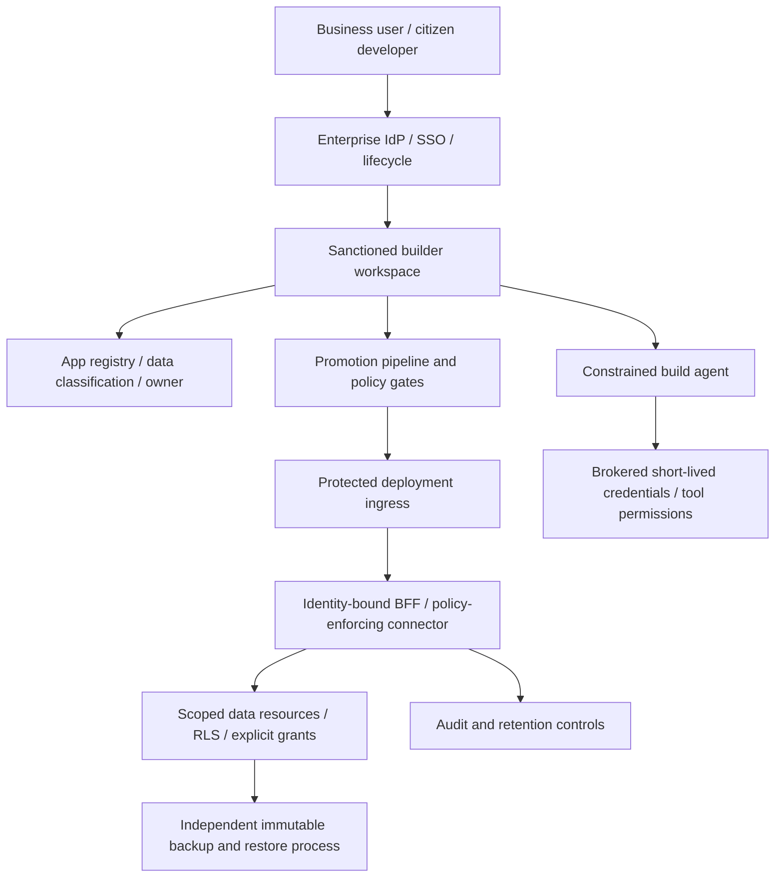

**Audit date:** 8 October 2026  
**Document reviewed:** `Vibe coding data leakage controls.md` (416 lines)  
**Review type:** Technical and evidentiary critique; original research preserved  
**Disposition:** **Needs revision before publication or use as procurement/compliance evidence**

> **Scope and epistemic limits:** This review examines the supplied report's argument, source provenance, select headline quantitative claims, vendor feature descriptions, security design and regulatory conclusions. A subset of consequential assertions has been checked against linked primary publications and current vendor documentation. It is **not** a line-by-line forensic verification of every hyperlink, individual CVE, incident or product price. “Not independently verified” is not an assertion of falsehood. Cross-references to lines refer to the *original* report.

## Executive judgment

The report has a **strong central security thesis**: when business users create and publish applications through AI builders, authorization, publishing policy, credential access, data classification and backup boundaries cannot safely depend on prompts or generated code alone. The strongest defenses are centrally enforced identity, scoped resource access, restricted deployment, deterministic testing and genuine separation of development from production.

Its principal weakness is **evidentiary compression**: highly selected security scans, vendor-controlled examples, product documentation, individual incidents, benchmark results, legal requirements and the author's architecture recommendations are often written with similar levels of certainty. Several sentences also confuse a risk, a failure, an actual breach, and a mandatory notification. Readers should trust the overarching *direction* more than the report's precise counts, prevalence language, platform comparisons or categorical legal conclusions without further checking.

**Bottom line:** retain the overall architecture, but revise misleading technical language, recalculate and relabel benchmark claims, qualify compliance statements, and insert an explicit evidence-confidence column into product and incident comparisons.

## Verdict key

- **Confirmed:** corroborated by primary, directly relevant material in this review.
- **Broadly sound / qualify:** technically persuasive but overgeneralized or missing consequential exceptions.
- **Correction required:** materially misleading or wrong as stated.
- **Unverified:** the cited report may support the claim, but this audit has not established the underlying detail independently.
- **Recommendation:** architectural judgment, not a measured outcome.

## A. Priority corrections

| ID | Original location | Finding | Verdict | Suggested edit |
|---|---|---|---|---|
| A1 | Lines 10–22, 170–192 | An `anon`/publishable Supabase key in browser JavaScript is expected design, **not itself a leaked privileged secret**. Exposure becomes exploitable through privileges, RLS, RPC or other authorization defects. | **Correction required** | Say “internet-accessible Data API plus overly permissive grants/RLS” and distinguish privileged `service_role`/secret tokens. |
| A2 | Line 20 | “An anonymous visitor can delete your tables” conflates deleting *rows* with executing DDL `DROP TABLE`. API `DELETE` permissions can delete records and empty a table without the ability to drop the table object. | **Correction required** | “May delete or modify database records, potentially emptying tables.” |
| A3 | Lines 170–184, 368–369, 406 | Supabase's **30 October 2026** explicit-grants rollout is real, but covers **new tables created after the applicable rollout**; pre-existing tables preserve grants. RLS itself does not change. Direct PostgreSQL connections are not covered. | **Confirmed with critical caveat** | Add a separate audit of existing grants, existing RLS policies and privileged DB/RPC paths. |
| A4 | Lines 4, 219–233, 413 | SusVibes **10.5%** is a particular agent/model's secure **and** functionally correct outcome on security-oriented tasks, not a universal security pass rate. The headline description of “best agent” is ambiguous; the best joint rate reported was **12.5%** in a different agent/model pairing. | **Correction required** | Identify tested setup, population and success definition; separate functional success, secure conditional on correct, and joint success. |
| A5 | Lines 336–346 | GDPR Art. 33 reporting is **not automatic** whenever exposure occurs. Notification to authority is subject to risk threshold; notification to affected individuals has another threshold under Art. 34. | **Correction required** | Describe detection, legal assessment, risk determination, documentation and applicable 72-hour notification. |
| A6 | Lines 130–136, 391–408 | GDPR Art. 30 records concern **processing activities**, not one mandatory ROPA entry per application. A single app may support several processing purposes, and multiple apps can support one processing activity. | **Correction required** | Link app registry entries to processing-activity records and DPIA screening, rather than equating each app to a ROPA entry. |
| A7 | Lines 326–330 | AWS logically air-gapped vaults can integrate with **optional**, separately configured multi-party approval; approval is not automatically required for every restore. | **Correction required** | Say “configure MPA for protected recovery workflows where needed,” with its organizational prerequisites and failure modes. |
| A8 | Lines 308–315 | Cloudflare AI Gateway DLP does not inspect base64 binary payloads; **cache hits skip a new scan**, so changes to a DLP policy may not apply to already-cached responses until expiry or cache bypass. | **Confirmed with nuance** | Specify DLP scope and cache invalidation / isolation policy, not generic “DLP protects all traffic.” |
| A9 | Lines 360, 348 | Dates of the July 2026 **EU AI Omnibus**, Dec. 2027 Annex III and Aug. 2028 Annex I implementation are corroborated. However Art. 50 should not be simplistically described as applying to every app with generated content. | **Broadly sound / qualify** | Classify each AI feature and relevant actor duty; assess Art. 50 subparagraphs and transitional exceptions separately. |
| A10 | Lines 162–168, 364–385 | “ZTNA in front of an app calling BaaS is theatre for data” identifies a genuine bypass of **UI-only** identity gateways, but underrates proper backend authz and identity-bound RLS. | **Overstatement** | “UI-origin protection alone does not secure a separately reachable BaaS API; independently enforce authz at every data endpoint.” |
| A11 | Lines 186–192, 411–415 | “BFF is structurally stronger” is defensible **when** the BFF enforces authorization and limits capabilities. Moving a service-role key server-side can enlarge blast radius if the server becomes a confused deputy. | **Overstatement** | Compare direct-to-BaaS with verified RLS against a tenant-bound, least-privilege BFF, not against an unrestricted proxy. |
| A12 | Lines 364–387 | “Works” means the author believes a control would interrupt a chosen incident path; the document does not show controlled efficacy studies across enterprise populations. | **Recommendation mislabeled as proven outcome** | Rename table to “Control impact by threat path,” with applicability, bypasses and assurance test. |

### Critical technical detail: Supabase grants versus RLS

The vendor changelog is unambiguous:

1. **Grants** answer whether database roles can invoke an operation on a table via the Data API.
2. **RLS policies** answer which rows a role may read or change when RLS is enabled.
3. Existing tables and their grants **are not retroactively fixed** by the 30 October rollout.
4. Direct SQL, privileged credentials, security-definer functions, public views and unsafe RPC endpoints require independent inspection.

A useful CI gate checks both privilege and policy behavior using anonymous, authenticated same-tenant and authenticated cross-tenant principals. `RLS enabled` or `policy exists` is not a sufficient assertion. See [Supabase official changelog](https://supabase.com/changelog/45329-breaking-change-tables-not-exposed-to-data-and-graphql-api-automatically).

## B. Incident evidence: what is supported, what remains open

| Incident / evidence | Audit judgment | What the example establishes | What it does **not** establish |
|---|---|---|---|
| Lovable RLS incident / CVE-2025-48757 | **Plausible and highly relevant; individual figures not re-audited** | Failed authorization in generated apps can expose sensitive data; key presence alone is not the failure. | The prevalence of vulnerable deployments among all Lovable or enterprise apps. |
| Moltbook database exposure, 2026 | **Supported as an actual incident by Wiz's first-party account; exact counts not rechecked** | Broken database access boundaries can expose tokens and private content. | That all hard-coded browser publishable keys are secrets or every exposed app is equally exploitable. |
| Symbiotic scan, 1,072 apps | **Sampling caveat essential** | Among the investigated sites, there were serious observable attack paths. | Representative vulnerability percentages for all vibe-coded apps; selection and discovery methods may bias sample. |
| Escape study, 5,600 apps | **Original methodology should accompany figures** | Meaningful findings exist at scale among accessible inspected sites. | An unbiased industry-wide probability of compromise; identified “secrets” need type classification. |
| RedAccess / public apps | **Credible signal; denominator ambiguous** | Public publishing and missing auth can expose business datasets outside managed IT. | That 380,000 discovered assets were all breaches, or that different reported 5,000 and 2,000 counts describe the same population. |
| Base44 registration / SSO bypass | **Vendor-platform trust-boundary failure; original Wiz account should be retained** | App-level generated code cannot fix every platform-level identity bug. | That tenant SSO offers no value, or that exploitation occurred. |
| Lovable chat/source regression | **Scope contested in the submitted report** | Prompts, chat records, source code and connection metadata are sensitive platform stores. | The broadest claimed affected population until independently substantiated. |
| Replit / SaaStr deletion | **Useful operational failure example; exact record counts not re-audited** | Agent access to production and weak environment separation can lead to data destruction. | That every agent ignores safety instructions or that prompts never reduce error rates. |
| PocketOS / Railway token | **Useful scope-and-backup case; event details not independently reconstructed** | Over-broad API credentials and coupled recovery paths create destructive blast radius. | That every Railway backup shared the deleted volume or every incident ended with permanent loss. |
| Tea Firebase incident | **Correctly presented as attribution uncertainty** | Historical insecure cloud storage is not unique to AI-produced applications. | A defensible causal assertion that AI code generation caused this breach. |

**Improvement:** Add an incident evidence ledger with incident date, source publication date, primary researcher/vendor acknowledgement, affected service layer (application/platform/agent), known access capability, confirmed impact, remediation, disputed details and source type. Avoid treating overlapping vendor scans as statistically independent evidence.

## C. Statistics and benchmark methodology

### What to preserve

- The document makes an important distinction between **functional correctness** and **security correctness**; a feature can work while still leaking data.
- Reports of public-data exposure, credential mishandling and improper authorization justify engineering controls independently of any single prevalence estimate.
- The report appropriately expresses caution about the Tea incident's uncertain connection to AI-generated code.

### What to change

1. **SusVibes denominator:** clarify that the results concern a selected set of 200 security-related coding tasks, not 200 randomly chosen business-builder apps. The figure `10.5%` is a *joint* success outcome for a specific configuration; it must not become “89.5% of vibe-coded apps are vulnerable.” [Original academic study](https://arxiv.org/html/2512.03262v2).
2. **“Flat ~55% for two years”:** this broad claim requires consistent model sets, prompt conditions, language/weakness mix, and measurement methodology across years. Until checked, label it as vendor-reported benchmark trend rather than a settled cross-industry trajectory. [Veracode blog cited by original report](https://www.veracode.com/blog/securing-genai-code-manage-risk).
3. **RLS scan prevalence:** distinguish client-key discovery, existence of a vulnerable HTTP endpoint, demonstrated unauthorized **read**, demonstrated unauthorized **write/delete**, and exposure of genuinely sensitive business data. These are different endpoints and denominators.
4. **Employee use surveys:** do not treat “unauthorized tool usage,” “personal account usage” and “apps published outside IT” as the same metric or population. Each vendor has separate measurement and commercial incentives.
5. **AI security review precision:** extreme precision ranges across vendors are not directly comparable without identical benchmark datasets and ground truth; the Bright Security experiment uses an extremely small and conflicted sample.
6. **Gartner predictions:** forecasts about app retirement or maintenance pressure are scenarios/analyst expectations, not observations.
7. **Slopsquatting:** the absence of a publicly reported observed attack at a particular date is weak evidence of absence. Keep package-hallucination numbers separate from malicious-exploitation counts.

**Suggested common metadata:** `source`, `sample selection`, `period`, `N`, `unit`, `numerator`, `definition of issue`, `confirmation method`, `limitations`, `independent replication`.

## D. Vendor capability and deployment architecture

### Four security boundaries that must not be conflated

| Boundary | Core question | Correct test |
|---|---|---|
| Builder identity / workspace | Can an employee create projects or use sanctioned connectors? | SSO/SCIM lifecycle, admin policy, shadow personal-account discovery. |
| Published application ingress | Who can load the app and call its server routes? | Anonymous and external requests through canonical and alternate origins, previews, domains, bypass headers. |
| Data/connector API | What data may a principal read or modify? | Negative authorization tests with anonymous, cross-role and cross-tenant requests; explicit resource scopes. |
| Agent execution plane | What could the coding agent read, install, transmit or destroy? | Host sandbox checks, egress limits, credential capabilities, MCP tools/hooks, production access, backup separation. |

A Cloudflare Access-protected HTML page with a separately accessible Supabase API has two independent security boundaries. The public API is **not automatically insecure** if it enforces properly designed grants and RLS. Conversely, an application BFF that proxies through an unrestricted service-role credential is not automatically safe merely because the browser no longer holds a database key.

### Vendor assertions requiring fresh evidence at procurement

The original report catalogs Vercel, Netlify, Lovable, Replit, Base44, Power Platform, Cloudflare, Supabase and AI gateways. The feature inventory is valuable as a *due-diligence starting point*, **not** an independently tested procurement matrix.

For each vendor, ask for documented and tested answers to:

- **Scope:** workspace, project, production deployment, preview deployment, build-time environment or API?
- **Default:** secure default for newly created enterprise tenants, or manually enabled premium feature?
- **Policy enforcement:** enforced by tenant admins, inherited by new projects, or voluntarily configured by each builder?
- **Identity:** actual end-user federation, builder-console SSO, team membership, shared links, or an identity-aware proxy?
- **Data path:** first-party server route, direct BaaS, generated serverless API, MCP tool, or external connector?
- **Bypasses:** customer-owned domains, platform subdomains, preview URLs, alternate ports, REST/RPC endpoints, and public assets?
- **Observability:** immutable admin audit, downloadable inventory, provisioning events, external-publish logs, API access logs?
- **Contract:** DPA, subprocessor lists, retention, model-training exceptions, cross-border transfers, deletion from backups, breach notification and enterprise support?

**Security architecture recommendation:** classify each deployment via concrete *trust paths*, not the builder brand alone.

### Two additional corrections from primary product documentation

**AWS Backup:** logically air-gapped vaults store recovery points in an AWS Backup service-owned account and provide compliance-mode lock protection. **Multi-party approval is an optional integration requiring additional setup**, not a universal mandatory step for every restore. [AWS vault documentation](https://docs.aws.amazon.com/aws-backup/latest/devguide/logicallyairgappedvault.html), [AWS MPA documentation](https://docs.aws.amazon.com/aws-backup/latest/devguide/multipartyapproval.html).

**Cloudflare AI Gateway DLP:** only text in request/response bodies is inspected; encoded file content is not decoded. Cache hits do not re-run DLP, so existing cached results can outlive rule changes. Blocking streaming outputs can also require buffering the entire response, increasing latency. [Official DLP documentation](https://developers.cloudflare.com/ai-gateway/features/dlp/).

## E. Agent controls, prompts and deterministic boundaries

The report's ranking of protections is **directionally right** but “deterministic” must not mean “cannot ever be bypassed.” A sandbox can fail open through permitted host tools, inherited credentials or an external MCP server; a SAST check can deterministically execute yet miss a logical cross-tenant bug; a provider gateway may not inspect all binary payloads; and an internal package mirror may allow a malicious dependency if curation is weak.

A more precise risk framework is:

| Control type | Examples | Assurance offered | Residual failure |
|---|---|---|---|
| Generation guidance | Prompts, repo policies, stack-specific skills | Improves probability of secure output | Wrong, forgotten, injected, or incomplete instructions. |
| Detection | SAST, SCA, secret scanning, AI review | Finds certain known issues | False negatives, incomplete coverage, logically incorrect authz. |
| Runtime / infrastructure prevention | Restricted egress, least-privilege credentials, constrained brokers, verified RLS | Limits available operations, even with bad code | Misconfiguration, alternate path, privileged escape. |
| Verification | Attack-path tests, role/tenant matrix, restore drills | Demonstrates a selected security property against tests | Incomplete threats, changing configuration, regression. |
| Recovery | Separate immutable copies, versioning, disaster recovery | Reduces impact of destructive actions | Unrestorable data, correlated compromise, RPO/RTO limits. |

**Specific overlooked issue:** a code freeze enforced only through a system prompt is not a code freeze. Protect deployment APIs and branch permissions outside the model; deny production mutations through identity policies. Likewise, exposing a high-privilege MCP tool to an agent should be handled as exposing the privilege to an untrusted execution context.

## F. GDPR, AI Act, DORA and compliance accuracy

### GDPR

The legal discussion must distinguish four different propositions:

1. **Data-protection design duty:** GDPR Articles 25 and 32 set risk-based organizational and technical requirements. A missing protection may be strong evidence of deficient safeguards but is not a categorical violation without context.
2. **Personal-data breach:** Article 4(12) covers relevant confidentiality, integrity and availability incidents involving personal data; not every platform bug or security defect means a personal-data breach occurred.
3. **Regulatory notification:** Article 33 applies subject to its risk-based exception and timing provisions. **Seventy-two hours** is measured against controller awareness of a qualifying breach, and later information can supplement initial notice.
4. **Affected-person notification:** Article 34 is a separate higher threshold; not every Article 33 report requires individual notice.

**ROPA:** the legal unit is a *processing activity*. Application inventory is indispensable operational governance but does not map one-to-one to Art. 30 entries. DPIAs under Art. 35 are triggered by likely high-risk processing, not by every new citizen app.

**Processor/controller roles:** a personal SaaS signup does not automatically establish the SaaS as a processor in every operation. Actual purpose/means, contracts and data flows determine roles. An employee copying personal data into a personal builder account is a potentially serious uncontrolled disclosure, but needs fact-specific legal assessment.

[GDPR official text](https://eur-lex.europa.eu/eli/reg/2016/679/oj)

### EU AI Act

The submitted report correctly reports that the **AI Omnibus entered into force on 27 July 2026** and moved specified Annex III high-risk obligations to **2 December 2027**, and relevant Annex I obligations to **2 August 2028**. These dates are corroborated by the European Commission and consolidated legal text. However:

- Not every vibe-coded application is an AI system under the Act merely because an AI tool was used to author its source code.
- A conventional CRUD application generated with AI may have GDPR and cyber-security obligations but no AI Act end-user transparency obligation on that basis alone.
- Whether Article 50 applies requires classification of the deployed AI functionality, provider/deployer roles, output type, recipient context and relevant transition rules.
- The amended AI-literacy framework should be described from the **current consolidated text**, not older summaries alone.

Sources: [European Commission, 27 July 2026](https://digital-strategy.ec.europa.eu/en/news/ai-omnibus-enters-force); [consolidated regulation](https://eur-lex.europa.eu/legal-content/EN/TXT/?uri=CELEX:02024R1689-20260727); [AI Act FAQ](https://ai-act-service-desk.ec.europa.eu/en/ai-act/faq/when-does-enforcement-start).

### DORA / NIS2 / cross-jurisdiction

The original report appropriately labels some application to AI builders as its own inference. Preserve the **in-scope entity** and **specific third-party function** qualifiers. A builder may be within third-party due diligence but this cannot be declared as a universal DORA or NIS2 duty for every enterprise and every citizen app. Verify local implementation and the applicable contractual chain for legal use.

## G. Accuracy assessment by major section

| Source section | Assessment | Publication recommendation |
|---|---|---|
| Opening thesis and four failure modes | **Strong direction; headline statistics need sourcing discipline** | Retain thesis; separate verified incidents from survey prevalence and inference. |
| RLS and client-side keys | **Technical correction necessary** | Rewrite key-versus-permissions and row-versus-table descriptions. |
| Public-by-default shadow IT | **Convincing risk model, uncertain denominator comparisons** | Reconcile the RedAccess numbers and visibility baselines. |
| Platform bugs | **Relevant distinct failure category** | Separate confirmed vendor statements from contested researcher scope. |
| Agent destruction | **Relevant incident mechanism** | Avoid claiming identical root cause or backup layout across providers. |
| Amnesty / paved road | **Good strategy, insufficient comparative outcome evidence** | Label as proposed operating model, not proven dominant market approach. |
| Discovery | **Technically credible, necessarily incomplete** | Discuss wildcard hostnames, attribution precision, false positives, and personal identities. |
| Supabase grants/RLS | **Date confirmed; impact overclaimed** | Audit existing objects independently; explicit grants don't validate RLS. |
| Identity-aware proxy | **Correct concern about bypass** | Explain independent security of API path and origin validation. |
| BFF / governed connectors | **Useful design option, not intrinsically secure** | Require resource scopes, tenancy, authz, rate limiting and audit. |
| Secret management | **Good distinction between server secrets and client bundles** | Explicitly classify intentionally public tokens. |
| Security scanners | **Strong call for enforced gates** | Avoid claiming gate coverage includes business authorization correctness. |
| Prompts / agent skills / AI review | **Broadly sensible; quantitative evidence not fully comparable** | Tie claims to actual task distributions and confidence. |
| Sandboxes / MCP / registries | **Valid defense-in-depth advice** | Replace absolute “only controls” language and document bypass edges. |
| Backups and retention | **Strong high-level principle, one AWS overstatement** | Make MPA optional; define RPO/RTO and actual restore validation. |
| GDPR / AI Act | **GDPR categorical statements need material repair; AI Act dates largely sound** | Obtain legal review before publication. |
| Works versus theatre | **Useful rhetorical heuristic, too binary** | Replace with threat-path efficacy + limitations matrix. |
| Tier model and rollout | **Good author proposal, not validated industry standard** | Show ownership, exceptions, kill-switch design and assurance evidence. |

## H. A sharper reference architecture

This is **my proposed synthesis**, not a factual description of deployed enterprise consensus.

**Invariants to test:**

- A new app cannot be published to an internet-accessible audience without the relevant policy decision.
- A user from tenant A cannot retrieve or mutate tenant B data, whether through the UI, a direct REST endpoint, GraphQL, RPC, or a generated server route.
- Builder identity and end-user application identity are separately established and auditable.
- No tool accessible to a non-engineering build agent can modify a production database or its disaster-recovery copies.
- Build-time source/prompt data and runtime app/LLM data have independently defined retention, classification and egress policies.
- A missing app owner, expired temporary app or revoked user leads to a determinable quarantine action.
- Backend services use tightly scoped capabilities; storing a master service token server-side is not accepted as a substitute for authorization.

## I. Suggested verification test matrix

| Test | Principal / starting state | Action | Expected observation |
|---|---|---|---|
| Public publish prevention | Citizen developer, new project | Attempt public production deployment | Denied unless authorized policy/approval. |
| UI gateway bypass | Anonymous visitor | Access platform/custom origin and previews | No protected app or API access through alternate route. |
| Anonymous data access | No user token; publishable DB key | `SELECT`, `INSERT`, `PATCH`, `DELETE` against protected resources | Operations blocked at API/DB boundary. |
| Cross-tenant read | Authenticated tenant B user | Read tenant A records via API/RPC | Zero unauthorized rows; no helpful data leak in errors. |
| Cross-tenant update | Authenticated tenant B user | Update tenant A record | Forbidden, no side effect. |
| Service credential isolation | Build agent under sanctioned workflow | Search file tree, env, logs, MCP tools | No production secret or privileged destructive API accessible. |
| Production deletion | Agent with normal build credentials | Attempt destructive volume / DB operation | Infrastructure refuses, even if agent asks directly. |
| Recovery | Independent break-glass role | Restore isolated copy | Restore completes within measured RTO/RPO; no dependency on deleted primary. |
| Revoked employee | IdP removes team user | Access builder and deployed app | Access removed across both layers; orphaned assets assigned/quarantined. |
| DLP policy change | Cached LLM output | Update policy and request same payload | No stale uninspected response when policy demands re-evaluation. |

## J. Recommended editorial rewrite order

**P0, before leadership or regulatory distribution:**

1. Correct GDPR notification language and ROPA-per-app assertion.
2. Correct browser key versus authorization, and records versus tables.
3. Qualify Supabase October rollout and distinguish future from existing tables.
4. Correct SusVibes framing and comparison of joint success scores.
5. Fix the AWS MPA claim.

**P1, before security architecture or procurement decisions:**

6. Split confirmed incident findings, vendor claims, independent tests and author inference into visible evidence tiers.
7. Reconcile RedAccess/scan denominators; remove extrapolations unsupported by sampling.
8. Change the blanket BFF and ZTNA verdicts to explicit trust-path analysis.
9. Convert the vendor feature table into a dated buyer-validation matrix (default, SKU, scope, enforceability, bypass, audit evidence).
10. Replace binary “works/theatre” judgments with measurable prevention, detection and recovery properties.

**P2, editorial and operational:**

11. Mark product pricing and preview exposure as date-sensitive.
12. Add owner transfer, offboarding, versioning, exception management and third-party supplier review to the lifecycle.
13. Separate business-user acceptable-use policy from product-run security policy.
14. Add meaningful restore testing, provider failure modes, incident tabletop exercises and exception audit.
15. Replace unsourced claim that no company publishes a practice with a bounded statement about sources reviewed.

## K. Overall decision

**Does the report identify the right enterprise problem?** Yes.

**Is the report technically solid enough to guide the broad architecture?** Broadly yes, once the reader recognizes that explicit identity, data-path authorization, separate agent privileges, and disaster recovery need individual testing.

**Are its precise numerical claims and vendor-by-vendor comparisons fully established here?** No; several are source-reported, selection-biased, dated, or independently unchecked.

**Is it safe to reuse its legal claims without modification?** No. GDPR notification, Article 30 and controller/processor conclusions require correction and legal review.

**Can it be cited as a verified independent industry survey?** No. It is a sophisticated synthesis of selected research and vendor sources, not a representative measurement of enterprise adoption or control effectiveness.

**Publication status:** **Needs revision**. The core thesis should survive; the certainty labels, some technical statements, and portions of the legal analysis should not.

## L. Sources checked in this audit

The following are **primary or official evidence** used to check key claims. Most other hyperlinks in the original manuscript were not independently reopened in this pass and must not be mistaken for re-verified evidence.

1. Supabase, **Breaking Change: Tables not exposed to Data and GraphQL API automatically**, 28 April 2026: <https://supabase.com/changelog/45329-breaking-change-tables-not-exposed-to-data-and-graphql-api-automatically>
2. SusVibes, academic benchmark cited by source report: <https://arxiv.org/html/2512.03262v2>
3. GDPR, official EUR-Lex regulation: <https://eur-lex.europa.eu/eli/reg/2016/679/oj>
4. European Commission, **AI Omnibus enters into force**, 27 July 2026: <https://digital-strategy.ec.europa.eu/en/news/ai-omnibus-enters-force>
5. EU AI Act, consolidated text as of 27 July 2026: <https://eur-lex.europa.eu/legal-content/EN/TXT/?uri=CELEX:02024R1689-20260727>
6. EU AI Act Service Desk, implementation and transparency enforcement: <https://ai-act-service-desk.ec.europa.eu/en/ai-act/faq/when-does-enforcement-start>
7. AWS Backup, logically air-gapped vault: <https://docs.aws.amazon.com/aws-backup/latest/devguide/logicallyairgappedvault.html>
8. AWS Backup, **Multi-party approval** (optional integration): <https://docs.aws.amazon.com/aws-backup/latest/devguide/multipartyapproval.html>
9. Cloudflare, **AI Gateway DLP**, inspection and cache limitations: <https://developers.cloudflare.com/ai-gateway/features/dlp/>
10. Cloudflare, **AI Gateway caching**: <https://developers.cloudflare.com/ai-gateway/features/caching/>
11. Wiz, **Moltbook database research** cited in original: <https://www.wiz.io/blog/exposed-moltbook-database-reveals-millions-of-api-keys>
12. Original Lovable RLS vulnerability research: <https://mattpalmer.io/posts/statement-on-CVE-2025-48757/>

---

### Audit integrity note

This is an **independent critical review**, not a certification, external pentest, legal opinion, verified procurement comparison, or exhaustive re-research of all ~400 lines. Claims explicitly designated as not re-audited remain open. A publication-grade next pass would open every incident's primary disclosure, collect publication and incident dates, reconcile source denominators, verify current paid SKU and control defaults in vendor documentation or trial tenants, and obtain qualified legal review.
